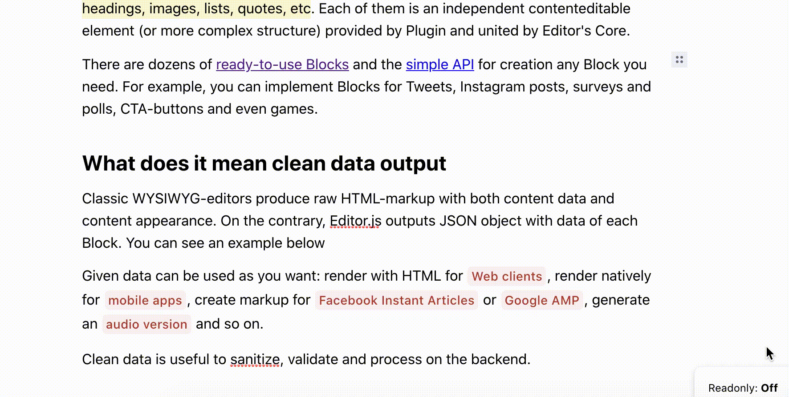

# Footnotes Tune
Footnotes Block Tune for the [Editor.js](https://editorjs.io).



> ☝️ Because of [FireFox bug](https://bugzilla.mozilla.org/show_bug.cgi?id=1665167) Tune doesn't work well there.

## Installation

### Install via NPM or Yarn

Get the package

```shell
npm i --save-dev @editorjs/footnotes
```
or
```shell
yarn add @editorjs/footnotes --dev
```

Include module in your application

```javascript
const FootnotesTune = require('@editorjs/footnotes');
```

### Load from CDN
Load the script from [jsDelivr](https://www.jsdelivr.com/package/npm/@editorjs/footnotes) CDN and connect to your page.

<script src="https://cdn.jsdelivr.net/npm/@editorjs/footnotes@latest"></script>

### Build from source code
1. Clone the repo
2. Run `yarn` to install dependencies
3. Run `yarn build` to build the package
4. Add `dist/bundle.js` file to your page.

## Usage
Add a new Tool to the `tools` property of the Editor.js initial config.

```javascript
var editor = EditorJS({
  ...
  
  tools: {
    ...
    footnotes: {
      class: FootnotesTune,
    }
  }
  
  ...
});
```

To enable Footnotes Tune for other blocks, just add a `tunes` property to their configuration:

```typescript
var editor = EditorJS({
  ...
  
  tools: {
    list: {
      class: ListTool,
      tunes: ['footnotes'], // note that stirng here should be the same as tools object key for Tune  
    },
    paragraph: {
      tunes: ['footnotes'], // note that stirng here should be the same as tools object key for Tune  
    },
    footnotes: {
      class: FootnotesTune,
    }
  }
  
  ...
});
```

You can pass additional configuration for the Tune

```javascript
var editor = EditorJS({
  ...
  
  tools: {
    ...
    footnotes: {
      class: FootnotesTune,
      config: {
        placeholder: 'Your placeholder for footnotes popover',
        shortcut: 'CMD+SHIFT+F',
      },
    },
  },
  
  ...
});
```

## Config Params

| Field              | Type     | Description                              |
| ------------------ | -------- | ---------------------------------------- |
| placeholder        | `string` | placeholder for empty footnote popover   |
| shortcut           | `string` | shortcut to insert Footnote element      |

## Output data

This tune inserts `sup` elements to Block's content with `data-tune="footnotes"` attribute so you can find them on render.

Also, on Block save you'll get `tunes` property inside saved data with `footnotes` property (the same as the key in the initial configuration).

`tune.footnotes` property contains array of strings respectively to each sup element in Block's content

```json
{
  "type": "paragraph",
  "data": {
    "text": "You text with a footnote<sup data-tune=\"footnotes\">1</sup>. And another footnote<sup data-tune=\"footnotes\">2</sup>"
  },
  "tunes": {
    "footnotes": [
      "This is a text for the first footnote",
      "And text for the second one"
    ]
  }
}
```

# Support maintenance 🎖

If you're using this tool and editor.js in your business, please consider supporting their maintenance and evolution.

[http://opencollective.com/editorjs](http://opencollective.com/editorjs)

# About CodeX


CodeX is a team of digital specialists around the world interested in building high-quality open source products on a global market. We are [open](https://codex.so/join) for young people who want to constantly improve their skills and grow professionally with experiments in leading technologies.

| 🌐 | Join  👋  | Twitter | Instagram |
| -- | -- | -- | -- |
| [codex.so](https://codex.so) | [codex.so/join](https://codex.so/join) |[@codex_team](http://twitter.com/codex_team) | [@codex_team](http://instagram.com/codex_team) |
